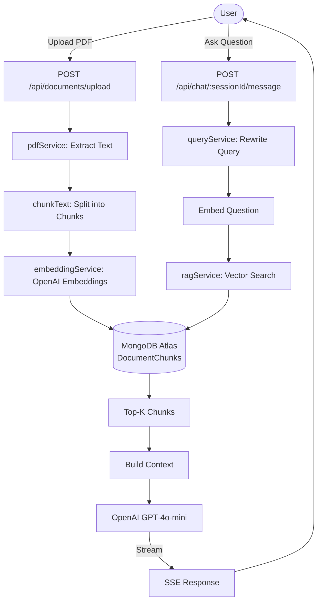

# ◈ PolicyPilot

> **Domain-specific RAG Document Assistant for Insurance Policies**
> Upload your insurance PDFs. Ask plain-English questions. Get answers grounded in your documents with exact source citations.

---

## Problem Statement

Understanding insurance policies is notoriously difficult. Documents run 50–100 pages, contain dense legal language, and critical clauses are buried in appendices. PolicyPilot solves this by letting users ask natural questions and receive precise answers backed by retrieved evidence from their own documents.

---

## Features

- 🔐 **JWT Authentication** — secure register/login with bcrypt password hashing
- 📄 **PDF Upload & Processing** — drag-and-drop upload with animated pipeline progress
- 🧩 **Smart Text Chunking** — overlapping paragraph-aware chunking (no LangChain)
- 🔢 **OpenAI Embeddings** — `text-embedding-3-small` (1536 dimensions)
- 🔍 **MongoDB Atlas Vector Search** — cosine similarity with user-level isolation
- 💬 **Streaming Chat** — SSE-based token-by-token response streaming
- 📌 **Source Citations** — every answer shows exact PDF name and page number
- 🔄 **Query Rewriting** — handles follow-up questions by rewriting to standalone form
- 📱 **Mobile-First Design** — brutalist editorial UI with responsive layouts

---

## Architecture



---

## RAG Pipeline

### Ingestion Pipeline

```
PDF Buffer
    ↓  pdfService.extractTextFromPDF()
Raw Text + Page Count
    ↓  chunkText() [800 chars, 150 overlap]
Array of Chunks
    ↓  embeddingService.embedBatch()
1536-dim Vectors
    ↓  DocumentChunk.insertMany()
MongoDB Atlas
```

### Query Pipeline

```
User Question
    ↓  rewriteQuery() [handles follow-ups]
Standalone Question
    ↓  embedText()
Query Vector
    ↓  $vectorSearch [cosine, top-5, filtered by userId]
Relevant Chunks
    ↓  buildContext() [up to 6000 chars]
LLM Prompt
    ↓  openai.chat.completions.create() [streaming]
Token Stream (SSE)
    ↓  Save to Message model
Answer + Sources
```

---

## Tech Stack

| Layer | Technology |
|---|---|
| Frontend | React 19, Vite, Tailwind CSS |
| Routing | React Router v6 |
| HTTP Client | Axios + Fetch (SSE) |
| Backend | Node.js, Express.js |
| Database | MongoDB Atlas |
| ODM | Mongoose |
| Auth | JWT, bcrypt |
| File Upload | Multer (memory storage) |
| PDF Parsing | pdf-parse |
| Embeddings | OpenAI `text-embedding-3-small` |
| LLM | OpenAI GPT-4o-mini |
| Vector Search | MongoDB Atlas Vector Search |

**Deliberately avoided:** LangChain, LlamaIndex, Pinecone, Redis

---

## MongoDB Atlas Vector Search Setup

1. Go to your Atlas cluster → **Atlas Search** → **Create Search Index**
2. Select **Vector Search**
3. Use this JSON configuration:

```json
{
  "fields": [
    {
      "type": "vector",
      "path": "embedding",
      "numDimensions": 1536,
      "similarity": "cosine"
    },
    {
      "type": "filter",
      "path": "userId"
    }
  ]
}
```

4. Name the index exactly: `vector_index`
5. Apply to the `documentchunks` collection

> **Important:** The `userId` filter field ensures users can only retrieve their own documents.

---

## Authentication Flow

```
POST /api/auth/register
    → Validate input
    → Check email uniqueness
    → bcrypt.hash(password, 12)
    → User.create()
    → jwt.sign({ id }, JWT_SECRET, { expiresIn: '7d' })
    → Return token + user

POST /api/auth/login
    → Find user by email (select +password)
    → bcrypt.compare(candidate, hash)
    → jwt.sign()
    → Return token + user

Every Protected Request:
    → Authorization: Bearer <token>
    → authMiddleware: jwt.verify()
    → req.user = User.findById(decoded.id)
```

---

## Query Rewriting

Follow-up questions are rewritten to be standalone before embedding:

| Turn | Input |
|---|---|
| User | "What is hospitalization coverage?" |
| AI | "Your policy covers up to ₹5 lakh..." |
| User | "What about senior citizens?" |
| Rewritten | "What is the hospitalization coverage for senior citizens?" |

The rewritten question is embedded and used for vector search — the original question is sent to the LLM for answer generation.

---

## Source Citations

Every AI answer includes:

```json
{
  "sources": [
    {
      "documentId": "...",
      "documentName": "Health_Insurance_Policy.pdf",
      "pageNumber": 7,
      "chunkIndex": 14,
      "excerpt": "Hospitalization coverage is provided up to ₹5 lakh per annum..."
    }
  ]
}
```

---

## Installation

### Prerequisites

- Node.js 18+
- MongoDB Atlas account
- OpenAI API key

### Setup

```bash
# Clone
git clone <repo-url>
cd RAG-Project

# Install server dependencies
cd server
npm install
cp .env.example .env
# Edit .env with your values

# Install client dependencies
cd ../client
npm install
```

### Environment Variables

Create `server/.env`:

```env
PORT=5000
MONGO_URI=mongodb+srv://<user>:<pass>@<cluster>.mongodb.net/policypilot
JWT_SECRET=your_secret_here
OPENAI_API_KEY=sk-...
NODE_ENV=development
TOP_K=5
MAX_FILE_SIZE=10485760
```

### Run

```bash
# Terminal 1 — Backend
cd server
npm run dev

# Terminal 2 — Frontend
cd client
npm run dev
```

App runs at:
- Frontend: `http://localhost:5173`
- Backend API: `http://localhost:5000`

---

## API Endpoints

### Auth
| Method | Endpoint | Description |
|---|---|---|
| POST | `/api/auth/register` | Register new user |
| POST | `/api/auth/login` | Login and get JWT |
| GET | `/api/auth/me` | Get current user |

### Documents
| Method | Endpoint | Description |
|---|---|---|
| POST | `/api/documents/upload` | Upload PDF (multipart/form-data) |
| GET | `/api/documents` | List user's documents |
| GET | `/api/documents/:id` | Get document by ID |
| DELETE | `/api/documents/:id` | Delete document + chunks |

### Chat
| Method | Endpoint | Description |
|---|---|---|
| POST | `/api/chat/sessions` | Create chat session |
| GET | `/api/chat/sessions` | List user's sessions |
| GET | `/api/chat/sessions/:id` | Get session + messages |
| DELETE | `/api/chat/sessions/:id` | Delete session |
| POST | `/api/chat/:sessionId/message` | Send message (SSE streaming) |

---

## Interview Q&A

**Q: How does the RAG pipeline work?**
> PDF → text extraction → overlapping chunking → OpenAI embeddings → MongoDB vector storage. At query time: embed the question → vector search for top-5 chunks → build context string → send to GPT with system prompt → stream answer.

**Q: Why MongoDB for vector search instead of Pinecone?**
> Keeps the stack unified (one database for both structured data and vectors), reduces latency, and MongoDB Atlas Vector Search is production-grade. Avoids external dependency.

**Q: How do you prevent users from accessing each other's documents?**
> The `$vectorSearch` filter includes `userId` constraint, and all queries are additionally double-filtered with `$match`. The `protect` middleware validates JWT on every request.

**Q: How does query rewriting work?**
> A lightweight GPT call rewrites follow-up questions to be self-contained using recent conversation history. This ensures the vector search finds relevant chunks even for pronoun-heavy follow-ups like "what about that?"

---

## Future Improvements

- [ ] Multi-PDF context (search across all documents simultaneously)
- [ ] PDF page highlighting / visual source preview
- [ ] Streaming progress for document ingestion
- [ ] Support for scanned PDFs via OCR (Tesseract)
- [ ] Export conversations as PDF
- [ ] Admin analytics dashboard
- [ ] Rate limiting and abuse prevention
- [ ] Docker + CI/CD pipeline
- [ ] Vercel / Railway deployment guide

---

## License

MIT
